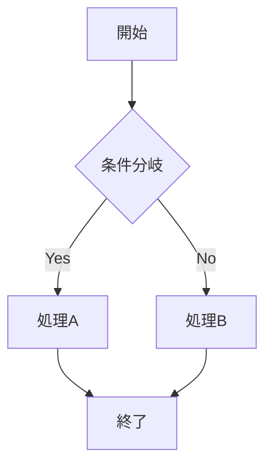
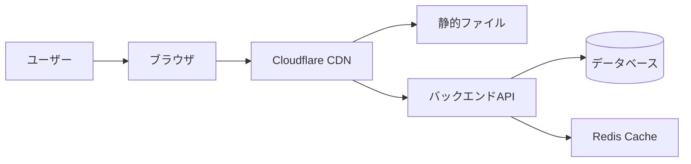
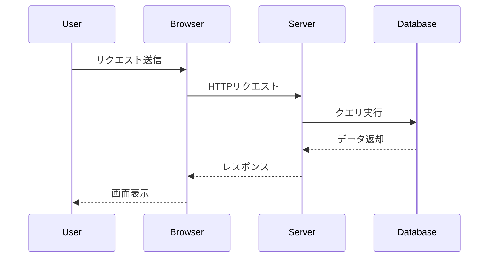

この記事はMermaid図の自動レンダリング機能をテストするためのものです。

## シンプルなフローチャート

以下は基本的なフローチャートです：

```mermaid
graph TD
    A[開始] --> B{条件分岐}
    B -->|Yes| C[処理A]
    B -->|No| D[処理B]
    C --> E[終了]
    D --> E
```

## システムアーキテクチャ図

次は少し複雑な図です：

```mermaid
graph LR
    User[ユーザー] --> Browser[ブラウザ]
    Browser --> CDN[Cloudflare CDN]
    CDN --> Static[静的ファイル]
    CDN --> API[バックエンドAPI]
    API --> DB[(データベース)]
    API --> Cache[Redis Cache]
```

## シーケンス図

最後にシーケンス図も試してみます：

```mermaid
sequenceDiagram
    participant U as User
    participant B as Browser
    participant S as Server
    participant D as Database

    U->>B: リクエスト送信
    B->>S: HTTPリクエスト
    S->>D: クエリ実行
    D-->>S: データ返却
    S-->>B: レスポンス
    B-->>U: 画面表示
```

以上、3つのMermaid図が正しく表示されれば成功です。
