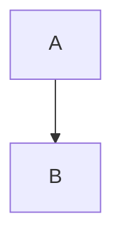

# Mermaid図の自動生成・埋め込み機能 実装計画

作成日: 2025年12月24日

## 0. 概要

Markdown記事内に記述されたMermaid図をelm-pagesのビルドプロセスで自動的に画像化し、記事内に埋め込む機能を実装する。
記事執筆者はMermaidコードを記事内に直接書くだけで、ビルド時に自動的に画像生成・置換が行われる。

### 実装の目的

現状の課題：

- 記事内のMermaid図は一部環境（GitHub等）でしか表示されない
- 手動で画像を生成・管理する必要があり、メンテナンス性が低い
- ソースコードと画像の同期が困難

実装後の改善：

- 記事内にMermaidコードを直接記述
- ビルド時に自動的にSVG画像を生成
- 画像への参照に自動置換
- バージョン管理はMermaidソースのみで完結
- GitHubでもサイトでも正しく表示

## 1. アーキテクチャ設計

### データフロー

```text
Markdown記事ファイル
  ↓
BackendTask.File.bodyWithFrontmatter
  ├─ フロントマターとボディを読み込み
  ↓
Custom BackendTask: processMermaid
  ├─ Markdownソース（フロントマター有無両対応）を入力
  ├─ ```mermaid ブロックを抽出
  ├─ 各ブロックにハッシュベースのIDを付与
  ├─ mermaid-cli (mmdc) で並列にSVG生成
  │  └─ dist/images/diagrams/<hash>.svg
  ├─ Markdownソース内のmermaidブロックを画像参照に置換
  └─ 処理済みMarkdownソースを返す
  ↓
既存のMarkdownレンダリング処理
  └─ HTML生成
```

### 主要コンポーネント

#### 1. CustomBackendTask module（新規作成）

`src/BackendTask/MermaidDiagram.elm`:

- **`processMermaid`**: Markdownソース全体を処理するメイン関数
  - 入力: Markdownソース（フロントマター有無両対応）
  - 出力: 処理済みMarkdownソース（mermaidブロックが画像参照に置換済み）
- TypeScript側のカスタムBackendTaskと連携
- アトミックな操作により、既存のMarkdown処理に手を加える必要なし

#### 2. TypeScript BackendTask実装

`custom-backend-task.ts`に以下の関数を追加：

- **`processMermaid`**: Markdownソース全体を処理するメイン関数
  - Mermaidブロックの抽出
  - 各ブロックの画像生成（並列実行）
  - Markdownソース内の置換
  - 処理済みMarkdownソースを返す

#### 3. 呼び出し側の統合

各記事を読み込むroute moduleで、`processMermaid`を挟む：

- `BackendTask.File.bodyWithFrontmatter`でMarkdownソースを読み込み
- `MermaidDiagram.processMermaid`で処理
- 処理済みソースを既存のdecoder/rendererに渡す
- **既存の`src/Markdown.elm`は変更不要**

## 2. 実装の詳細

### Phase 1: カスタムBackendTaskの基盤整備

**目的**: TypeScript側でMermaid処理を行うBackendTask関数を実装

**タスク**:

1. **mermaid-cliの依存関係追加**
   ```bash
   npm install -D @mermaid-js/mermaid-cli
   ```

2. **custom-backend-task.tsに`processMermaid`関数を追加**

   `processMermaid`:
   - 入力: Markdownソース文字列（フロントマター有無両対応）
   - 処理:
     1. 正規表現で```mermaidブロックを抽出
     2. 各ブロックのソースからハッシュベースのIDを生成
     3. 抽出した各ブロックを一時ファイル（`.mmd`）に書き出し
     4. `Promise.all`で並列に`mmdc`コマンド実行、SVG生成
     5. 生成したSVGを`dist/images/diagrams/<id>.svg`に配置
     6. Markdownソース内の```mermaidブロックを``に置換
   - 出力: 処理済みMarkdownソース文字列

3. **エラーハンドリング**
   - mermaid-cliの実行失敗時の適切なエラーメッセージ
   - 無効なMermaid構文の検出
   - ファイルI/Oエラーの処理

**成果物**:

- `custom-backend-task.ts`の更新
- `package.json`の更新（mermaid-cli追加）

**確認方法**:
```bash
npm install
npm run build
```

### Phase 2: Elm側BackendTask moduleの実装

**目的**: TypeScriptのBackendTaskをElmから呼び出せるようにする

**タスク**:

1. **`src/BackendTask/MermaidDiagram.elm`を作成**

   ```elm
   module BackendTask.MermaidDiagram exposing (processMermaid)

   import BackendTask exposing (BackendTask)
   import BackendTask.Custom
   import Json.Decode
   import Json.Encode

   {-| Markdownソース内のMermaidブロックを画像参照に置換する

   入力: Markdownソース（フロントマター有無両対応）
   出力: 処理済みMarkdownソース
   -}
   processMermaid : String -> BackendTask String
   processMermaid markdownSource =
       BackendTask.Custom.run "processMermaid"
           (Json.Encode.string markdownSource)
           Json.Decode.string
   ```

2. **シンプルな設計**
   - TypeScript側で全処理を完結させる
   - Elm側は単にカスタムBackendTaskを呼び出すだけ
   - エラーハンドリングもTypeScript側で実施

**成果物**:

- `src/BackendTask/MermaidDiagram.elm`

**確認方法**:
```bash
elm-pages gen  # 新しいmoduleの認識
npm run build
```

### Phase 3: 記事読み込みパイプラインへの統合

**目的**: 記事を読み込む各route moduleで`processMermaid`を使用する

**タスク**:

1. **記事読み込み箇所の特定**

   以下のファイルで記事コンテンツを読み込んでいる箇所を特定：
   - `app/Route/Articles.elm`
   - `app/Route/Articles/*.elm`（個別記事ルート）
   - その他、Markdownファイルを読み込む箇所

2. **`processMermaid`の呼び出しを追加**

   典型的なパターン：
   ```elm
   import BackendTask.MermaidDiagram as MermaidDiagram

   data : BackendTask Data
   data =
       BackendTask.File.bodyWithFrontmatter takeBody
           ("articles/" ++ meta.contentId ++ ".md")
           |> BackendTask.allowFatal
           |> BackendTask.andThen MermaidDiagram.processMermaid
           |> BackendTask.andThen
               (\processedBody ->
                   processedBody
                       |> Decode.run cmsArticleDecoder
                       |> BackendTask.fromResult
               )
   ```

3. **既存のMarkdown.elmは変更不要**

   - Mermaid処理は記事読み込み時点で完了
   - 以降は通常のMarkdownとして扱われる
   - 既存のレンダリングロジックをそのまま使用

**成果物**:

- 各記事読み込みroute moduleの更新（`src/Markdown.elm`は**変更不要**）

**確認方法**:
```bash
npm run build  # Mermaid処理を含むフルビルド
npm start  # 記事表示確認（Mermaid処理済みHTMLが表示される）
```

**注意**: `npm start`の開発サーバーでもMermaid処理が実行されるため、記事内のMermaid図が正しく画像として表示されることを確認できます。

### Phase 4: 画像生成ディレクトリの整備

**目的**: 生成された画像の適切な配置と配信

**タスク**:

1. **ディレクトリ構造**

   ```text
   dist/
   └─ images/
      └─ diagrams/
         ├─ <hash1>.svg
         ├─ <hash2>.svg
         └─ ...
   ```

2. **`.gitignore`の更新**

   ```gitignore
   # Mermaid生成画像
   dist/images/diagrams/
   ```

3. **_routes.jsonの更新**（Cloudflare adapter）
   ```json
   {
     "exclude": [
       "/images/*"
     ]
   }
   ```

**成果物**:

- `.gitignore`の更新
- ディレクトリ作成（初回ビルド時に自動作成されるため、手動作成は不要）

### Phase 5: エラーハンドリングとデバッグ機能

**目的**: 開発体験の向上とトラブルシューティング

**タスク**:

1. **詳細なエラーメッセージ**
   - Mermaid構文エラーの行番号を表示
   - mermaid-cli実行エラーの詳細を出力
   - 画像生成失敗時のフォールバック

2. **デバッグモード**
   - 環境変数で制御：`DEBUG_MERMAID=true`
   - Mermaidソースと生成画像の対応をログ出力
   - 中間ファイルを残すオプション

3. **ビルド時の進捗表示**
   - "Rendering X mermaid diagrams..."
   - 各図の処理状況

**成果物**:

- エラーハンドリングコードの追加
- デバッグ用ログの実装

**確認方法**:
```bash
DEBUG_MERMAID=true npm run build
```

### Phase 6: テストとドキュメント

**目的**: 機能の品質保証と利用方法の明確化

**タスク**:

1. **ユニットテスト**
   - Mermaidブロック抽出の正規表現テスト
   - ブロック置換ロジックのテスト
   - JSON codec テスト

2. **統合テスト**
   - サンプルMarkdownファイルでエンドツーエンドテスト
   - 複数のMermaid図を含む記事のテスト
   - エラーケースのテスト

3. **ドキュメント作成**
   - `docs/MERMAID_USAGE.md`: 記事執筆者向けの使い方
   - コード内コメント: 実装の詳細説明

**成果物**:

- テストコード
- ドキュメント

**確認方法**:
```bash
npm run test
npm run build
```

## 3. 技術的な詳細

### Mermaidブロックの識別方法

正規表現パターン：
```javascript
const mermaidBlockRegex = /```mermaid\n([\s\S]*?)\n```/g;
```

ブロックID生成：
```javascript
import crypto from 'crypto';

function generateBlockId(source) {
  return crypto
    .createHash('sha256')
    .update(source)
    .digest('hex')
    .substring(0, 16);
}
```

### mermaid-cliの実行

```javascript
import { exec } from 'child_process';
import { promisify } from 'util';

const execAsync = promisify(exec);

async function renderMermaidDiagram({ id, source }) {
  const inputPath = `temp/${id}.mmd`;
  const outputPath = `dist/images/diagrams/${id}.svg`;

  // 一時ファイル書き出し
  await fs.writeFile(inputPath, source);

  // mermaid-cli実行
  await execAsync(`npx mmdc -i ${inputPath} -o ${outputPath}`);

  // 一時ファイル削除
  await fs.unlink(inputPath);

  return { id, imagePath: `/images/diagrams/${id}.svg` };
}
```

### Markdownでの置換

置換前：

````markdown

````

置換後：

```markdown

```

代替テキストはオプションで指定可能にする：

````markdown
<!-- mermaid: alt="リクエストフロー図" -->
```mermaid
...
```
````

## 4. パフォーマンス考慮事項

### ビルド時間への影響

- Mermaid図1つあたり約0.5〜2秒の処理時間
- 並列処理で最適化（Promise.all使用）
- キャッシュによる再生成スキップ

### キャッシュ戦略

1. **ソースベースのキャッシュ**
   - Mermaidソースのハッシュをファイル名に使用
   - 内容が変わらなければ既存の画像を再利用

2. **ビルドメタデータ**
   ```json
   {
     "diagrams": {
       "abc123": {
         "source": "graph TD...",
         "path": "/images/diagrams/abc123.svg",
         "lastGenerated": "2025-12-24T10:00:00Z"
       }
     }
   }
   ```

## 5. 既知の制限事項と将来の拡張

### 制限事項

- Mermaid構文の複雑さによっては生成に時間がかかる場合がある
- mermaid-cliのバージョンに依存する制約
- SVGのみサポート（PNG等は将来対応可能）

### 将来の拡張案

1. **他の図ツールのサポート**
   - PlantUML
   - Graphviz
   - D2

2. **対話的な図の埋め込み**
   - Mermaid.jsのランタイム読み込みオプション
   - ズーム・パン可能な図

3. **図のテーマカスタマイズ**
   - サイトのテーマに合わせた色設定
   - ダークモード対応

## 6. 実装の順序

推奨される実装順序：

1. Phase 1: カスタムBackendTaskの基盤整備
2. Phase 2: Elm側BackendTask moduleの実装
3. Phase 4: 画像生成ディレクトリの整備
4. Phase 3: 記事読み込みパイプラインへの統合
5. Phase 5: エラーハンドリングとデバッグ機能
6. Phase 6: テストとドキュメント

各フェーズ後に`npm run build`で動作確認を行う。

## 7. ロールバック計画

実装中に問題が発生した場合：

1. **Phase 1-2の段階**: 新規ファイルの削除で元に戻せる
2. **Phase 3以降**: Markdown処理の分岐を残し、フラグで制御
   ```elm
   if enableMermaid then
       MermaidDiagram.processMermaidInMarkdown markdown
   else
       BackendTask.succeed markdown
   ```

## 8. セキュリティ考慮事項

- Mermaidソースは信頼できる記事作成者のみが編集
- mermaid-cliは外部入力を直接実行しないため、コマンドインジェクションのリスクは低い
- 生成されるSVGファイルは静的アセットとして配信

## 9. 成功の評価基準

実装完了の判断基準：

- [ ] 記事内のMermaidブロックが自動的に画像化される
- [ ] GitHubとサイトの両方で正しく表示される
- [ ] ビルド時間が許容範囲内（記事1つあたり+5秒以内）
- [ ] エラーが適切に報告される
- [ ] 既存の記事・機能に影響がない
- [ ] ドキュメントが整備されている

## 10. 参考資料

- [mermaid-cli公式ドキュメント](https://github.com/mermaid-js/mermaid-cli)
- [elm-pages Custom BackendTask](https://elm-pages.com/docs/custom-backend-tasks/)
- [Mermaid構文リファレンス](https://mermaid.js.org/intro/)
