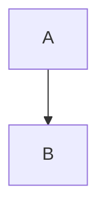

# Mermaid図のレンダリング機能 実装計画

作成日: 2025年12月24日
更新日: 2025年12月25日（クライアントサイドレンダリングへ方針変更）

## 0. 概要

Markdown記事内に記述されたMermaid図をクライアントサイド（ブラウザ）でレンダリングする機能を実装する。
記事執筆者はMermaidコードを記事内に直接書くだけで、ページ読み込み時に自動的に図として描画される。

### 実装方針の変更履歴

**当初の計画（2025-12-24）**:

- ビルド時にmermaid-cli（Puppeteer + Chromium）でSVG画像を生成
- カスタムBackendTaskで画像への参照に置換

**変更後の計画（2025-12-25）**:

- クライアントサイドでmermaid.jsを使用してレンダリング
- 既存のhighlight.jsと同様のruntime描画パターン

**変更理由**:

- ビルド時のPuppeteer依存関係による複雑性の回避
- GitHub Actionsでのシステムライブラリ要件の削減
- SSRルートでも動作可能な実装
- 既存のhighlight.jsパターンとの一貫性

### 実装の目的

現状の課題：

- 記事内のMermaid図はGitHub等の一部環境でしか表示されない
- 手動で画像を生成・管理する必要があり、メンテナンス性が低い
- ソースコードと画像の同期が困難

実装後の改善：

- 記事内にMermaidコードを直接記述
- ページ読み込み時に自動的に図として描画
- バージョン管理はMermaidソースのみで完結
- ビルド依存関係なし
- SSRでも動作

## 1. アーキテクチャ設計

### データフロー

```text
Markdown記事ファイル
  ↓
既存のMarkdownレンダリング処理
  ├─ ```mermaidブロックはコードブロックとして扱われる
  ├─ highlight.jsが language-mermaid クラスを付与
  └─ HTMLとして出力
  ↓
ページ読み込み (OnPageChange)
  ├─ Shared.elm が triggerMermaidRender を発行
  ↓
RuntimePorts経由でJavaScriptへ
  ├─ TriggerMermaidRender メッセージ受信
  ├─ document.querySelectorAll('pre code.language-mermaid')
  ├─ mermaid.js の mermaid.run() を実行
  └─ 各mermaidブロックがSVG図に置換される
```

### 主要コンポーネント

#### 1. Elm側（Shared.elm）

- **`triggerMermaidRender`**: RuntimePortsにメッセージを送る関数
  - メッセージ: `{ tag: "TriggerMermaidRender" }`
  - 呼び出しタイミング: `OnPageChange`時（highlight.jsと同様）

#### 2. JavaScript側（index.ts）

- **Mermaid.js CDN読み込み**: `<script>`タグで読み込み
- **RuntimePortsハンドラ**: `TriggerMermaidRender`を処理
  - `code.language-mermaid`要素を検索
  - mermaid.jsでレンダリング実行

#### 3. Markdown処理

- **既存のままで動作**: `src/Markdown.elm`は変更不要
- コードブロックとして処理される
- highlight.jsが適切なクラスを付与

## 2. 実装の詳細

### Phase 1: Elm側のRuntimePorts追加

**目的**: ページ変更時にMermaidレンダリングをトリガーする

**タスク**:

1. **`src/Shared.elm`に`triggerMermaidRender`関数を追加**

   ```elm
   triggerMermaidRender : Effect msg
   triggerMermaidRender =
       Json.Encode.object [ ( "tag", Json.Encode.string "TriggerMermaidRender" ) ]
           |> Effect.runtimePortsToJs
   ```

2. **`OnPageChange`ハンドラで呼び出し**

   ```elm
   OnPageChange req ->
       case initLightBox req of
           (Just _) as lbMedia ->
               ( { model | lightbox = lbMedia, queryParams = parseQuery req }
               , Effect.batch
                   [ lockScrollPosition
                   , triggerHighlightJs
                   , triggerMermaidRender  -- 追加
                   ]
               )

           Nothing ->
               ( { model | queryParams = parseQuery req }
               , Effect.batch
                   [ triggerHighlightJs
                   , triggerMermaidRender  -- 追加
                   ]
               )
   ```

**成果物**:

- `src/Shared.elm`の更新

**確認方法**:
```bash
npm run build
```

### Phase 2: JavaScript側のMermaid.js統合

**目的**: RuntimePortsメッセージを受けてMermaid図をレンダリング

**タスク**:

1. **`index.html`にMermaid.js CDNを追加**

   ```html
   <head>
     <!-- 既存のhighlight.js等 -->
     <script type="module">
       import mermaid from 'https://cdn.jsdelivr.net/npm/mermaid@11/dist/mermaid.esm.min.mjs';
       mermaid.initialize({
         startOnLoad: false,  // 手動で制御
         theme: 'default'
       });
       window.mermaid = mermaid;  // グローバルに公開
     </script>
   </head>
   ```

2. **`index.ts`のRuntimePortsハンドラに`TriggerMermaidRender`ケースを追加**

   ```typescript
   // RuntimePortsの型定義に追加
   type RuntimePortsToJs =
     | { tag: "TriggerHighlightJs" }
     | { tag: "TriggerMermaidRender" }  // 追加
     | ...

   // ハンドラに追加
   export const subscribe = (callbackFromElm) => {
     toJsSubscribers.push((data: RuntimePortsToJs) => {
       switch (data.tag) {
         case "TriggerHighlightJs":
           requestAnimationFrame(() => {
             document.querySelectorAll("pre code").forEach((block) => {
               hljs.highlightElement(block as HTMLElement);
             });
           });
           break;

         case "TriggerMermaidRender":  // 追加
           requestAnimationFrame(async () => {
             // mermaidブロックを検索して描画
             const mermaidBlocks = document.querySelectorAll("pre code.language-mermaid");
             if (mermaidBlocks.length > 0 && window.mermaid) {
               try {
                 // 各ブロックを処理
                 for (const block of Array.from(mermaidBlocks)) {
                   const pre = block.parentElement;
                   if (pre && !pre.dataset.mermaidRendered) {
                     const mermaidCode = block.textContent || "";
                     // preタグを一時divに置換
                     const div = document.createElement("div");
                     div.className = "mermaid";
                     div.textContent = mermaidCode;
                     pre.replaceWith(div);
                     pre.dataset.mermaidRendered = "true";
                   }
                 }
                 // mermaid.run()で一括レンダリング
                 await window.mermaid.run({
                   querySelector: ".mermaid:not([data-processed])"
                 });
               } catch (err) {
                 console.error("Mermaid rendering failed:", err);
               }
             }
           });
           break;

         // ... 他のケース
       }
     });
   };
   ```

3. **`window.mermaid`の型定義追加**

   ```typescript
   // index.ts の先頭に追加
   declare global {
     interface Window {
       mermaid?: {
         initialize: (config: any) => void;
         run: (config?: { querySelector?: string }) => Promise<void>;
       };
     }
   }
   ```

**成果物**:

- `index.html`の更新（Mermaid.js CDN追加）
- `index.ts`の更新（RuntimePortsハンドラ追加）

**確認方法**:
```bash
npm start
# 記事ページでMermaid図が表示されることを確認
```

### Phase 3: テスト記事での動作確認

**目的**: 実際の記事でMermaid図が正しくレンダリングされることを確認

**タスク**:

1. **テスト記事の作成または既存記事の使用**

   `articles/mermaid-test.md`:
   ````markdown
   ---
   title: Mermaid Diagram Test
   publishedAt: 2025-12-25
   ---

   # Mermaid Test

   フローチャート:

   ```mermaid
   graph TD
       A[開始] --> B{条件}
       B -->|Yes| C[処理1]
       B -->|No| D[処理2]
       C --> E[終了]
       D --> E
   ```

   シーケンス図:

   ```mermaid
   sequenceDiagram
       Alice->>Bob: Hello Bob!
       Bob-->>Alice: Hi Alice!
   ```
   ````

2. **動作確認**
   - `npm start`で開発サーバー起動
   - テスト記事ページにアクセス
   - Mermaid図が正しく表示されることを確認
   - ページ遷移時も再レンダリングされることを確認

**成果物**:

- テスト記事（必要に応じて）

**確認方法**:
```bash
npm start
# ブラウザで記事を開いて確認
```

### Phase 4: スタイリング調整（オプション）

**目的**: Mermaid図の見た目を調整

**タスク**:

1. **`style.css`にMermaid用スタイルを追加**

   ```css
   /* Mermaid図のスタイリング */
   .mermaid {
     display: flex;
     justify-content: center;
     margin: 1em 0;
   }

   .mermaid svg {
     max-width: 100%;
     height: auto;
   }
   ```

2. **テーマ設定の調整**

   `index.html`のmermaid.initialize()で:
   ```javascript
   mermaid.initialize({
     startOnLoad: false,
     theme: 'default',  // または 'dark', 'forest', 'neutral'
     themeVariables: {
       primaryColor: '#your-color',
       // ... カスタム変数
     }
   });
   ```

**成果物**:

- `style.css`の更新（オプション）
- Mermaid設定の調整（オプション）

## 3. 技術的な詳細

### Markdownでの記述方法

記事内のMermaidブロック（変更なし）:

````markdown

````

HTMLへの変換（highlight.jsにより）:

```html
<pre><code class="language-mermaid">graph TD
  A --> B
</code></pre>
```

Mermaid.jsによる最終レンダリング:

```html
<div class="mermaid" data-processed="true">
  <svg>...</svg>
</div>
```

### Mermaid.jsの設定オプション

```javascript
mermaid.initialize({
  startOnLoad: false,  // 手動でトリガー
  theme: 'default',    // テーマ選択
  themeVariables: {
    primaryColor: '#your-color',
    primaryTextColor: '#your-text-color',
    // ... その他の変数
  },
  flowchart: {
    useMaxWidth: true,
    htmlLabels: true,
  },
  sequence: {
    useMaxWidth: true,
  }
});
```

## 4. パフォーマンス考慮事項

### レンダリング時間

- Mermaid図1つあたり約10〜50ms（ブラウザ依存）
- ページ読み込み時に非同期で実行（`requestAnimationFrame`使用）
- ユーザー体験への影響は最小限

### クライアントサイド負荷

- **メリット**: ビルド時間の短縮、サーバー負荷なし
- **デメリット**: 初回描画の遅延、JavaScript必須

### 最適化戦略

1. **遅延ロード**: ページスクロールに応じて描画（将来的な拡張）
2. **キャッシュ**: ブラウザキャッシュによる再訪時の高速化
3. **CDN**: Mermaid.js自体はCDNから配信

## 5. 実装の順序

推奨される実装順序：

1. Phase 1: Elm側のRuntimePorts追加
2. Phase 2: JavaScript側のMermaid.js統合
3. Phase 3: テスト記事での動作確認
4. Phase 4: スタイリング調整（オプション）

各フェーズ後に動作確認を行う。

## 6. ロールバック計画

実装中に問題が発生した場合：

1. **Phase 1-2の段階**: 追加したコードをコメントアウト
2. **完全なロールバック**:
   - `src/Shared.elm`から`triggerMermaidRender`関連コードを削除
   - `index.html`からMermaid.js CDNを削除
   - `index.ts`から`TriggerMermaidRender`ケースを削除

## 7. セキュリティ考慮事項

- Mermaidソースは信頼できる記事作成者のみが編集
- mermaid.jsはクライアントサイドで実行されるが、サンドボックス化されている
- XSSリスクは既存のMarkdownレンダリングと同等
- CDNからの配信により、パッケージの整合性チェックが重要

## 8. 成功の評価基準

実装完了の判断基準：

- [ ] 記事内のMermaidブロックが自動的に図として描画される
- [ ] ページ遷移時に再描画される
- [ ] highlight.jsと同様の動作パターン
- [ ] JavaScriptが有効な環境で正しく表示される
- [ ] ビルド時間に影響がない
- [ ] 既存の記事・機能に影響がない

## 9. 利点と欠点

### 利点

- ✅ ビルド時間の短縮（Puppeteer不要）
- ✅ GitHub Actionsでの依存関係が不要
- ✅ SSRルートでも動作可能
- ✅ 既存パターン（highlight.js）との一貫性
- ✅ 実装がシンプル

### 欠点

- ⚠️ 初回描画時の遅延（通常は気にならないレベル）
- ⚠️ JavaScript無効環境では表示不可（コードブロックとして表示）
- ⚠️ サーバーサイドレンダリング（SSR）時はコードブロックのまま
- ⚠️ SEOへの影響（図の内容は検索エンジンにインデックスされない）

### 将来の拡張案（削除済み）

※ 当初計画していたサーバーサイド生成は複雑性のため見送り。
  必要に応じて将来的に検討可能。

## 10. 参考資料

- [Mermaid.js公式ドキュメント](https://mermaid.js.org/)
- [Mermaid CDN](https://www.jsdelivr.com/package/npm/mermaid)
- [elm-pages RuntimePorts](https://elm-pages.com/docs/runtime-ports/)
- [Mermaid構文リファレンス](https://mermaid.js.org/intro/)
- [既存のhighlight.js実装](../src/Shared.elm) - 参考パターン
